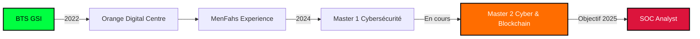

<div align="center">

# 🔐 OUMAR ALI MAHAMAT
### `Ethical Hacker • SOC Analyst • Cybersecurity Enthusiast`


[](https://www.linkedin.com/in/oumar-ali-mahamat-cybersecurity/)
[](https://www.youtube.com/@lemarou639/videos)
[](https://www.facebook.com/profile.php?id=100063481061853)
[](https://github.com/le-marou)


</div>

---

## 🎯 À PROPOS

```typescript
const oumar = {
    location: "Cameroun 🇨🇲",
    currentFocus: "Master 2 Cybersécurité & Blockchain",
    dream_role: "SOC Analyst",
    passions: ["Red Teaming", "Blue Teaming", "Malware Analysis", "OSINT"],
    background: {
        experience: ["Orange Digital Centre Cameroun", "MenFahs"],
        certifications: "En cours...",
        approach: "Autodidacte • Rigoureux • Team Player"
    },
    current_projects: [
        "🔴 Red Team Operations",
        "🔵 SOC Automation",
        "🎓 CTF Challenges",
        "📹 Cybersecurity Content Creation"
    ],
    fun_fact: "Je transforme le café en exploits ☕➡️💻🔓"
};
```

---

## 🛡️ ARSENAL TECHNIQUE

<details open>
<summary><b>🔴 Red Team & Offensive Security</b></summary>
<br>


**Compétences:**
- ✅ Web Application Penetration Testing
- ✅ Active Directory Attacks & Exploitation
- ✅ Social Engineering & Phishing Campaigns
- ✅ Vulnerability Assessment & Exploitation
- ✅ Network Security Testing

</details>

<details open>
<summary><b>🔵 Blue Team & Defensive Security</b></summary>
<br>


**Compétences:**
- ✅ Security Operations Center (SOC)
- ✅ Threat Hunting & Detection
- ✅ Log Analysis & Correlation
- ✅ Incident Response & Forensics
- ✅ Security Monitoring & Alerting

</details>

<details open>
<summary><b>💻 Développement & Scripting</b></summary>
<br>


**Focus:**
- ✅ Automation Scripts pour SOC
- ✅ Web Development (Django, React)
- ✅ Tool Development pour Pentesting
- ✅ Malware Analysis Scripts

</details>

---

## 📊 STATISTIQUES GITHUB

<div align="center">


</div>

---

## 🎥 DERNIÈRES VIDÉOS YOUTUBE

<div align="center">

<!-- BEGIN YOUTUBE-CARDS -->
[](https://www.youtube.com/watch?v=46LN42Ur9mE)
[](https://www.youtube.com/watch?v=7gTNjSHiBVA)
[](https://www.youtube.com/watch?v=FAPWvVnMR8w)
<!-- END YOUTUBE-CARDS -->

[](https://www.youtube.com/@lemarou639/videos)

</div>

---

## 🏆 CERTIFICATIONS & ACHIEVEMENTS

```ascii
┌─────────────────────────────────────────────────┐
│  🎯 En préparation:                             │
│  ┣━ CEH (Certified Ethical Hacker)             │
│  ┣━ OSCP (Offensive Security Certified Pro)    │
│  ┣━ Security+ / CySA+                           │
│  ┗━ BTL1 (Blue Team Level 1)                   │
│                                                  │
│  🔥 Objectif 2025: SOC Analyst Position        │
└─────────────────────────────────────────────────┘
```

---

## 🎯 PARCOURS DE FORMATION



---

## 💡 PROJETS PHARES

<div align="center">

| Projet | Description | Tech Stack | Status |
|--------|-------------|------------|--------|
| 🔴 **Red Team Lab** | Environnement de test d'intrusion AD | `PowerShell` `Bloodhound` `Mimikatz` | 🟢 Actif |
| 🔵 **SOC Dashboard** | Tableau de bord pour monitoring | `Python` `Elastic` `Kibana` | 🟡 En cours |
| 🎮 **CTF Writeups** | Solutions de challenges CTF | `Markdown` `Python` `Bash` | 🟢 Actif |
| 🌐 **Phishing Simulator** | Plateforme de sensibilisation | `Django` `JavaScript` `PostgreSQL` | 🟡 En cours |

</div>

---

## 📫 CONTACTEZ-MOI

<div align="center">

**Ouvert aux opportunités de collaboration et aux discussions sur la cybersécurité !**

[](mailto:votre-email@example.com)
[](https://www.linkedin.com/in/oumar-ali-mahamat-cybersecurity/)
[](https://twitter.com/votre-compte)
[](https://discord.gg/votre-serveur)

</div>

---

<div align="center">

### 💭 Citation du jour


</div>

---

<div align="center">

**⭐ Si vous aimez mon travail, n'oubliez pas de star mes repos !**


<sub>Made with 💚 and lots of ☕ by **Le Marou**</sub>

</div>
